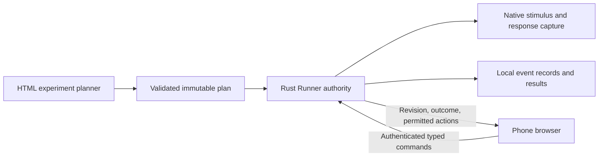

# PPS Kit source unification and critical audit

Date: 2026-09-27. Source reconciliation checkpoint: `de90f55`.
Scope: synchronize the existing repository, then audit proposed improvements.
Items 1–17 below are proposals for user selection, not approved implementation.

## Source synchronization result

- Local and public `main` contain the recovered Canzoneri 2013 tool-use work.
  There is one registered worktree, one local branch, one remote branch, and
  no remaining stash. No force push or merge of rewritten history occurred.
- The preserved committed tip `6387d7e` is an ancestor of source snapshot
  `82a9b6a`. Public consolidation commit `3471cfe` has exactly the same tree
  as that snapshot. Consequently the old committed work was already included
  in the public consolidation; merging its unrelated history would duplicate
  history without recovering additional content.
- The missing change comprised 25 dirty files. Its recovery used current
  repository paths and three-way reconciliation, retaining subsequent public
  changes. Additional affected tests and current-work guidance were updated.
- The recovery preserves the distinction between an executable parameter/count
  rehearsal and a demonstrated expected behavioral effect. The Canzoneri
  rehearsal is not counted as a completed effect comparison or replication.
- Pre-sync Git history, the original dirty files, and the former worktree's
  ignored artifacts remain in ignored local backups. Public archive tags also
  retain the old committed history. Generated/private artifacts were not added
  to Git.
- [Pages deployment for the source checkpoint](https://github.com/GeorgeFejer91/pps-kit/actions/runs/36320255963)
  succeeded. All 37 checked Designer, companion, vendor, and recovered template
  files match their Git blobs on the public site. Three text files differ from
  Windows working-tree bytes only through CRLF/LF checkout normalization.
  `/`, `/documentation`, `/download`, and `/experiment-runner/` respond successfully.

This establishes source synchronization. It does not establish that every
runtime check passes or that an installed application contains this revision.

## Verification and limits

| Check | Result |
|---|---|
| Recovered Canzoneri software validation | Passed: 188 trials, including 112 tactile responses and 76 auditory catches; software parameter/count evidence only |
| Affected profile and coverage tests | 29 passed; one existing local-source check skipped |
| Quick source checks | 30 tests passed; compile, JSON, release privacy, and whitespace checks passed |
| Runner browser checks | 57 tests passed; canonical build passed |
| Designer canonical build | Passed; tracked compiled output unchanged |
| Pages assembly and parity test | Passed; live Git-blob parity checked separately |
| Designer rendered geometry | 12 viewport cases passed; screenshots inspected |
| Companion rendered geometry | Controller and phone experiment modes checked at 320, 390, and 1440 px; no page errors or horizontal overflow |
| Full Python suite | Incomplete: disk exhaustion invalidated the first broad run; a subsequent run was interrupted before exhausting disk again |
| Rust core gate | Fails existing formatting differences in `native_output.rs` |
| Tauri desktop gate | Latest native CI fails existing Clippy gates; local attempt also encountered a disk-related linker failure |
| Installer, real phone network, native stimulus timing, hardware qualification | Not exercised in this source/audit task |

The five pinned Ponytail, Uncodixfy/Pretext, Tauri, remote-control, and For-AI
skill revisions in [SKILLS.md](../../../SKILLS.md) matched their upstream tips
at review time. This is not a claim that all application dependencies or the
scientific literature are current. No new literature sweep was requested or
performed for this technical audit.

## Numbered proposals

1. **Restore the native Rust verification gate first. Priority: immediate.**
   The [latest native workflow](https://github.com/GeorgeFejer91/pps-kit/actions/runs/33369161124)
   fails across Windows, Linux, and macOS. The core stops at three formatting
   differences; desktop Clippy reports unused generation fields/test helpers
   and an eight-argument `start` function. These findings predate this recovery.
   Apply the small formatting/ownership fixes, use or remove unused code, and
   retain meaningful warnings. Acceptance: the existing locked Core and Desktop
   checks pass on the configured Rust 1.88 toolchain and supported CI platforms.

2. **Make a clean checkout reproducible and keep test storage bounded. Priority: immediate.**
   The local editable Python installation still pointed at the pre-migration
   source layout until it was refreshed. The amputation and toolless validators
   still construct the old `For-AI/audiotactile-paper-metadata-audit` path even
   though reviews moved under `research/literature`. Broad tests also exceeded
   available disk space. Fix these specific path references, document the one
   existing setup command, and reduce redundant large synthetic fixtures or
   estimate their scratch requirement. Acceptance: a fresh environment runs
   the relevant validators and the complete Standard tier within a documented
   storage budget. Do not replace the current check system with another one.

3. **Make readiness claims refer to specific capabilities and evidence. Priority: immediate.**
   The For-AI router, stage separation, and source/Pages rules are useful and
   should remain. However, a broad “V1 qualified” or “V2 validated” statement
   can outlive the exact artifact and route that supplied its evidence.
   Maintain one compact record linking commit, package, capability, check, and
   qualification status. Keep parameter rehearsal, synthetic effect comparison,
   physical timing, participant behavior, and published replication distinct.
   The full-pipeline ledger also conflates missing effect comparison with missing
   runner evidence in some failure reasons. Acceptance: readiness labels point
   to evidence and explain the actual missing gate without duplicate ledgers.

4. **Apply Ponytail at ownership boundaries. Priority: medium.**
   Designer `app.js` is about 9,500 lines and its stylesheet about 8,200;
   Python dashboard, focus, and session runner modules are also very large.
   Rust execution ownership is substantial but already has useful crate and
   adapter boundaries. Extract one relevant seam when changing it: segment
   planning, job orchestration, native execution, or view rendering. Reuse
   `dashboard_backend`, `designer_segments`, and the existing Rust crates.
   Acceptance: a selected feature has one clear owner and fewer duplicate
   decisions. A frontend framework replacement or wholesale Python port is not
   justified by file length alone.

5. **Design the main screens around the experimenter's next action. Priority: high.**
   The inspected Designer screens pass basic geometry checks, but Segment 5
   emphasizes CSVs, filenames, and dense status summaries; Segment 6 repeats
   validated/locked cards. The phone controller opens with transport terminology,
   pairing machinery, and disabled controls. Present scientific conditions,
   trial counts, the blocking reason, and the next action first. Put file/transport
   details in an existing disclosure pattern. Separate “control the PC runner”
   from “run an exploratory experiment on this phone”; the shared browser-timing
   banner currently obscures that distinction. Acceptance: local previews let
   an operator understand readiness and act without reading protocol internals.

6. **Complete the bounded-text and accessibility contract where it matters. Priority: high.**
   Pretext is installed in Designer but used on two documentation paragraphs;
   it does not yet protect the planner's critical controls, and Runner does not
   use it. The typography helper initializes its result at the minimum font size
   without an explicit no-fit outcome. Reuse this helper selectively, add a
   no-fit path that preserves the complete label, and avoid shrinking text to
   defeat user zoom. Acceptance: touched screens work with long labels, 200%
   text enlargement, keyboard/focus navigation, loaded fonts, narrow portrait
   screens, and the actual WebView. Twelve viewport screenshots alone do not
   prove accessibility. See [WCAG reflow](https://www.w3.org/WAI/WCAG22/Understanding/reflow.html)
   and [target size](https://www.w3.org/WAI/WCAG22/Understanding/target-size-minimum.html).

7. **Make the planner produce an immutable, inspectable experiment plan. Priority: high.**
   Extend the existing Segment 0–6 workflow rather than introducing a second
   planner. Represent factors/conditions, repetitions, randomization seed,
   catches, baselines, instructions, and response rules in a versioned plan.
   Reuse current validation, frozen artifacts, and lineage hashes. Show the
   resulting trial/block schedule before expensive media generation. Acceptance:
   the same plan and seed reproduce the same schedule; edits invalidate the
   affected downstream acceptance; the final package contains the approved plan.
   Legacy packages remain supported through their explicit compatibility path.

8. **Add planner preflight and reliable job completion to existing jobs. Priority: high.**
   `dashboard_backend` already has bounded workers, queue limits, progress,
   cancellation, and completed-job retention. Keep that implementation. Add
   estimates for duration, output size, scratch space, and selected output
   channels before baking. Tie completion to the plan revision; use staged
   outputs when partial files could otherwise look complete. Acceptance:
   cancellation, low disk, stale-plan completion, and failed rendering leave
   a clear recoverable state without falsely accepting Segment 6.

9. **Build one complete Rust experiment execution path. Priority: high.**
   `prepared_execution.rs` explicitly returns `executable: false` and
   `timing_qualification: "unqualified"`. Native output status remains
   `silence_only: true`, `media_connected: false`, and non-executable. The Rust
   core deliberately prevents verified V1 package adoption from implying an
   executable target. Connect one supported prepared package to native media
   output, response capture, event records, completion, and safe pause/stop.
   Acceptance: one real experiment runs through the installed Rust shell and
   produces independently checked output. Qualification is a later measured
   gate, not a flag enabled when code compiles.

10. **Keep the Rust/HTML suite integrated through contracts, with incremental migration. Priority: high.**
    HTML should own views and interaction; Rust should own plan validation,
    command policy, session state, paths, timing, and durable results. Retain
    separate Designer and Runner distributions with one Shared component where
    the existing architecture requires them. Share contracts and assets instead
    of joining every screen into one executable. Use the current Python/Rust
    differential tests as an oracle while migrating one capability at a time.
    Acceptance: a selected Rust capability accepts the agreed V1 packages and
    produces compatible schedules/results. Keep proven Python analysis until
    there is a concrete reason and adequate oracle coverage to replace it.
    This follows [Tauri's process model](https://v2.tauri.app/concept/process-model/).

11. **Expose the Runner as a narrow command capability for the phone. Priority: high.**
    The existing Rust execution owner, bounded mailbox, BRSP protocol,
    principal-aware deduplication, and public state projection are foundations
    worth retaining. Add the selected experiment actions to that authority:
    inspect readiness, arm a permitted plan, start, pause, continue, and stop.
    Keep native file selection and scientific timing native. Establish shared
    Rust/JS protocol fixtures or generated schemas and explicit version
    negotiation so manual adapters do not drift. Acceptance: local UI and phone
    issue the same permitted actions and receive the same authoritative revision
    and result. Remote web content must not gain generic Tauri invocation;
    [Tauri capabilities](https://v2.tauri.app/security/capabilities/) remain scoped.

12. **Define retry limits and distinguish command acceptance from device execution. Priority: high.**
    The reducer's dedupe history evicts entries beyond 256 commands. Inference
    from code: a sufficiently late retry can therefore fall outside remembered
    outcomes; this becomes material when actions acquire durable side effects.
    Define a retry lifetime, authority/session generation, and expired-ID
    rejection or suitable retained outcomes. Preserve the current principal and
    payload binding. Report accepted, applied, native armed/running, completed,
    rejected, and unknown-after-disconnect states accurately. Acceptance: lost
    acknowledgments, cache eviction, changed payloads, stale revisions, and
    revoked grants cannot replay a run or silently create a second result.
    Use a small native event journal where recovery requires it; do not add a
    database solely to store transient UI state.

13. **Qualify one phone transport before adding more transports. Priority: high.**
    Existing WebRTC/VDO and LAN WebSocket adapters already cover candidate
    routes. The LAN listener binds all interfaces and serves HTTP; the browser
    includes an HMAC fallback for that environment. Authentication does not
    secure delivery of a modified HTTP client on a hostile network. Prefer a
    securely delivered companion and one measured supported route; make plain
    LAN preview limitations explicit. Keep the public beacon as discovery only,
    with local approval and authenticated control. Acceptance: real phones pass
    the chosen direct/relay route, reconnect, rejection, and network-loss cases.
    Add a WSS fallback only when measured network conditions require it.

14. **Handle phone suspension and control loss as explicit states. Priority: high.**
    Desktop and companion register one-shot `pagehide` cleanup without a paired
    resume path. Desktop polling skips hidden pages. Test Safari/Chrome tab
    switching, screen lock, rotation, BFCache restore, and lost acknowledgments.
    On resume, reconnect and fetch a fresh snapshot before enabling controls;
    never infer a completed command from a click. Decide the native experiment's
    control-loss policy explicitly: which actions require a lease, when a pause
    occurs, and what the local operator can recover. Acceptance: stale browser
    state cannot auto-start a trial or bypass the native safety lane.
    [Browser lifecycle guidance](https://developer.chrome.com/docs/web-platform/page-lifecycle-api)
    supports treating suspension/resume as more than normal visibility changes.

15. **Separate device trust, control roles, and participant information. Priority: high.**
    The current invitation uses an OS-generated high-entropy secret; retain it.
    The controller form can submit participant code, age, handedness, and gender,
    while the Rust public snapshot intentionally avoids participant details.
    Define observer/controller/setup permissions and remove demographics from
    remote flows unless that role needs them. If remembered phones are selected,
    use revocable, expiring native grants with browser device proof; a 24-hour
    grant is a product option, not current verified behavior. Acceptance: expiry,
    revocation, role downgrade, and public beacon/snapshot tests demonstrate the
    intended access and privacy limits. Human passwords would require a reviewed
    pairing design such as [OPAQUE](https://www.rfc-editor.org/rfc/rfc9807.html),
    rather than adapting the high-entropy invitation HMAC to a weak password.

16. **Patch the Designer development dependency chain with a small locked update. Priority: immediate.**
    The current Designer audit reports two high and one moderate vulnerable
    package nodes (Vite, nanoid, and esbuild); Runner reports zero. Designer uses
    Vite 6.1.0, whereas Runner already uses 6.4.3. Apply the smallest compatible
    patch and transitive lockfile updates, then rebuild and verify canonical
    bytes and the local Designer. The [Vite advisory](https://github.com/vitejs/vite/security/advisories/GHSA-fx2h-pf6j-xcff)
    includes a Windows issue affecting network-exposed development servers and
    identifies 6.4.3 as a patched 6.x version. This does not establish an exploit
    in the deployed static site. Acceptance: applicable advisories are resolved
    without unrelated dependency or framework upgrades.

17. **Require installed and physical evidence before presenting the suite as ready. Priority: high.**
    The existing source → package → qualified-release stages are the right
    structure. Attach exact revision/component/hash information to the next
    candidate, exercise installed Designer/Runner controls, and retain the
    current local/Pages byte checks. Then test real Android/iOS phones, supported
    direct/relay routes, command races, revocation, native output/response timing,
    and calibration appropriate to the acquisition route. Acceptance: every
    readiness claim identifies its supported platform, device/output route,
    measured timing evidence, and remaining limitations. Source synchronization
    alone must not silently update public download or installed-app claims.

## Recommended sequence for selection

First select 1, 2, 3, and 16 to establish a reliable baseline. Then pair planner
work (7–8) with one native execution path (9–10). Apply the UI work (5–6) to
those concrete flows. Phone control (11–15) should exercise that same native
authority, followed by the installed and physical gate (17). Apply the small
ownership changes in 4 as part of those features, not as a separate rewrite.

Proposed authority flow:

Research stimulus timing stays with native output. Phone-browser stimulus
generation remains a separate exploratory capability unless independently
qualified for its specific experimental claims.
